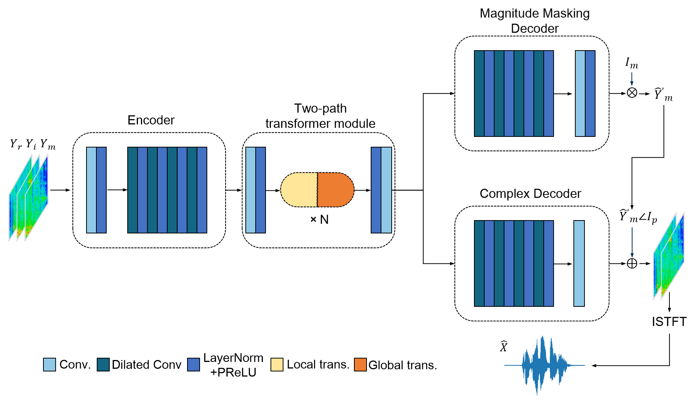

# TPTGAN
《Two-Path Transformer-Based Generative Adversarial Network Using Joint Magnitude Masking and Complex Spectral Mapping for Speech Enhancement》

This is the repository for our paper (ICONIP2023).
## Table of Contents
- [Overview](#overview)
- [Dependencies](#dependencies)
- [How to start](#how-to-start)
- [Citation](#citation)
## OverView
{:height="530" width="916"}

In recent studies, conformer is extensively employed in speech enhancement. Nevertheless, it continues to confront the challenge of excessive suppression, especially in human-to-machine communication, attributed to the unintended loss of target speech during noise filtering. While these methods may yield higher Perceptual Evaluation of Voice Quality (PESQ) scores, they often exhibit limited effectiveness in improving the signal-to-noise ratio of speech which is proved vital in automatic speech recognition. In this paper, we propose a two-path transformerbased metric generative adversarial network (TPTGAN) for speech enhancement in the time-frequency domain. The generator consists of an encoder, a two-stage transformer module, a magnitude mask decoder and a complex spectrum decoder. Encoder and two-path transformers characterize the magnitude and complex spectra of the inputs and model both sub-band and full-band information of the time-frequency spectrogram. The estimation of magnitude and complex spectrum is decoupled in the decoder, and then the enhanced speech is reconstructed in conjunction with the phase information. Through the implementation of intelligent training strategies and structural adjustments, we have successfully showcased the remarkable efficacy of the transformer model in speech enhancement tasks.


## Dependencies:
* pytorch
* numpy
* scipy
* h5py
* pesq
* pystoi

If you want to change the two path transformer block into conformer block which is also provided in the repository, the following dependency is needed.

* einops

<!-- ## File explanation:

## Trained models:
* Under trained_models/, we have a trained model. -->
## How to start:
### Dataset
1. Download VoiceBank+Demand dataset.
2. In our code, we organise every noisy speech and its according clean speech in a single file using h5py.
3. Generate the index .txt file whose every row represents the path of a speech pair generated in step 2.

Examples can be find in '/examples' folder.
### Training:
Get your training speech data prepared, set the right variable in your own situation.
* run `python train_gan_loss2.py`.

### Test:
Get your test speech data prepared, set the right variable in your own situation.
* run `python test.py`.

## Citation:

```
@inproceedings{liu2023tptgan,
  title={TPTGAN: Two-Path Transformer-Based Generative Adversarial Network Using Joint Magnitude Masking and Complex Spectral Mapping for Speech Enhancement},
  author={Liu, Zhaoyi and Jiang, Zhuohang and Luo, Wendian and Fan, Zhuoyao and Di, Haoda and Long, Yufan and Wang, Haizhou},
  booktitle={International Conference on Neural Information Processing},
  pages={48--61},
  year={2023},
  organization={Springer}
}
```
